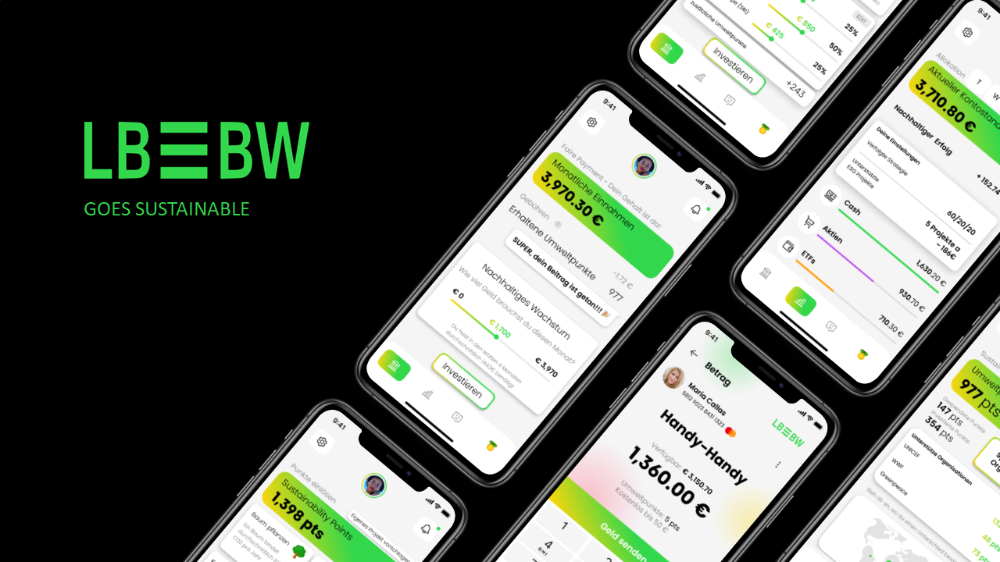

# EcoGrowth

Sustainability-Submission im Rahmen des MESH Innovation Summit by StuV DHBW Stuttgart.

# Titel der Solution

---

# Slogan der Solution

LBBW goes sustainable

# Kurzbeschreibung der Solution und PowerPoint-Präsentation mit den Schlüsselbotschaften

Revolutioniertes Banking, basierend auf einem "gestaffelten Kostenmodell, einem All in One System und Sustainability Payback".

Anhänge: /mockups, pitch_EcoGrowth.pdf

# Name des Teams und der einzelnen Teammitglieder

SO7 / Marvin Schmid, Alexander Pleli, Finn Wählt
